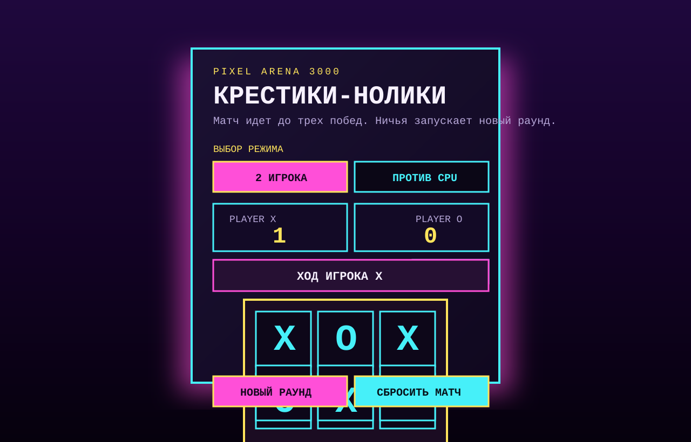
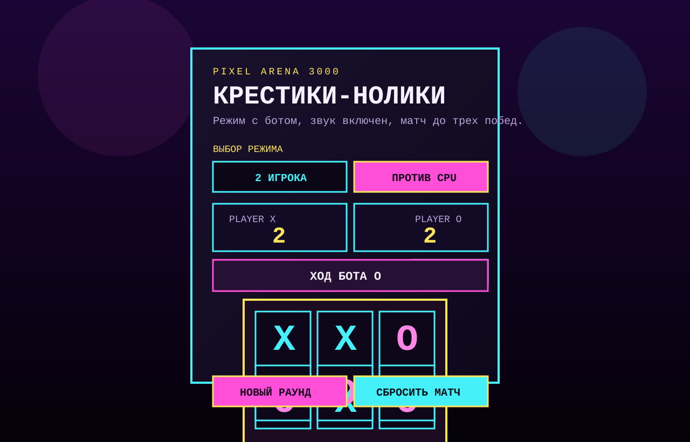

# Tic-Tac-Toe: Pixel Arena 3000

Ретро-версия игры "Крестики-нолики" для браузера с неоновым интерфейсом, матчами до 3 побед и режимом против бота.

## Что внутри

- Браузерная версия без зависимостей
- Ретро-стилистика с аркадным интерфейсом
- Матч до 3 побед
- Режим `игрок vs игрок`
- Режим `игрок vs бот`
- Сброс текущего раунда
- Сброс всего матча
- Звуковые эффекты
- Отдельная консольная версия игры

## Скриншоты

### Главное игровое окно



### Режим игры против бота



## Как запустить

### Браузерная версия

1. Убедитесь, что установлен Node.js.
2. Устанавливать зависимости не нужно, проект работает на встроенных модулях Node.js.
3. Запустите локальный сервер:

```bash
npm start
```

4. Откройте в браузере:

```text
http://localhost:3000
```

### Консольная версия

Если хотите запустить старую консольную реализацию:

```bash
npm run console
```

## Управление

- Выберите режим: против второго игрока или против бота
- Кликайте мышкой по клеткам поля
- Побеждает тот, кто первым соберет линию из трех одинаковых символов
- Ничья не приносит очков и сразу запускает следующий раунд
- Матч завершается, когда один из игроков набирает 3 победы

## Технологии

- HTML
- CSS
- JavaScript
- Node.js `http` server
- Web Audio API для звуков

## Структура проекта

```text
.
├── app.js
├── index.html
├── index.js
├── server.js
├── styles.css
└── assets/
```

## Идеи для развития

- Умный бот, который блокирует победные ходы
- Подсветка выигрышной линии
- Сохранение счета в `localStorage`
- Экран завершения матча
- Настройка темы и звуков

## Лицензия

ISC
